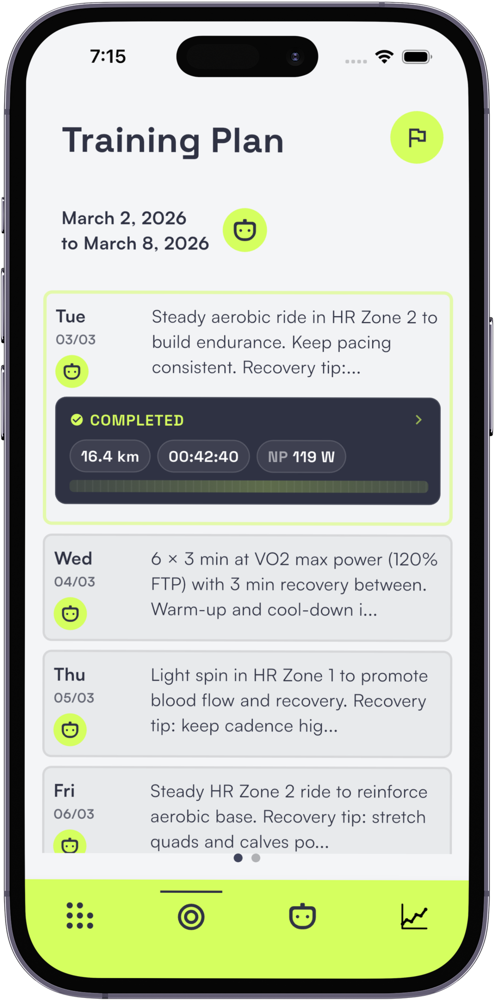
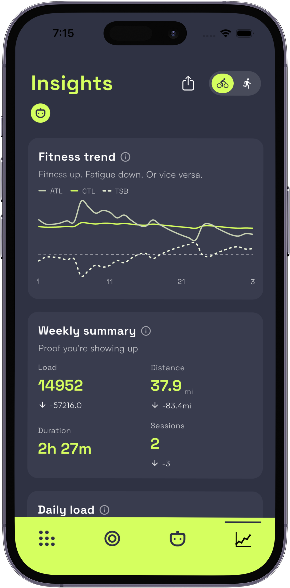
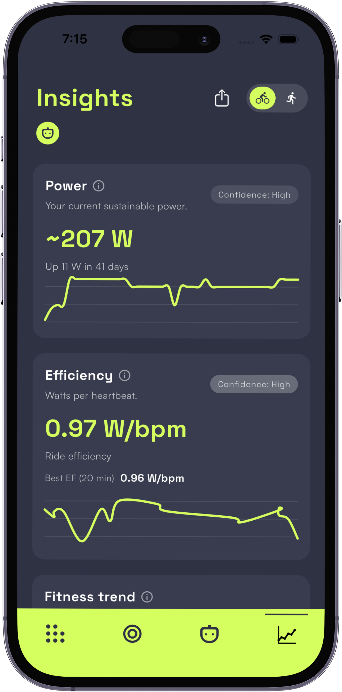
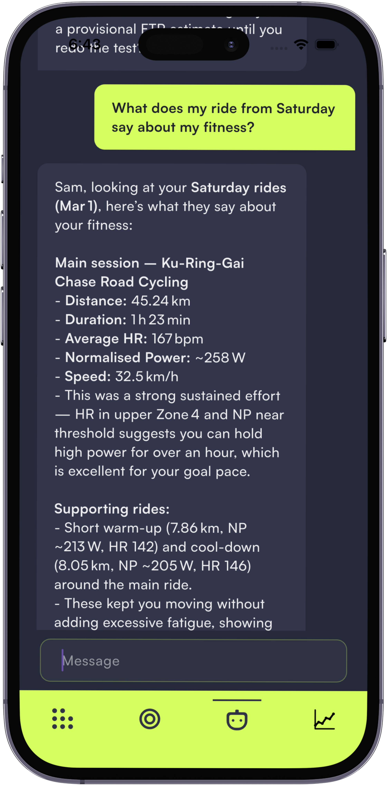
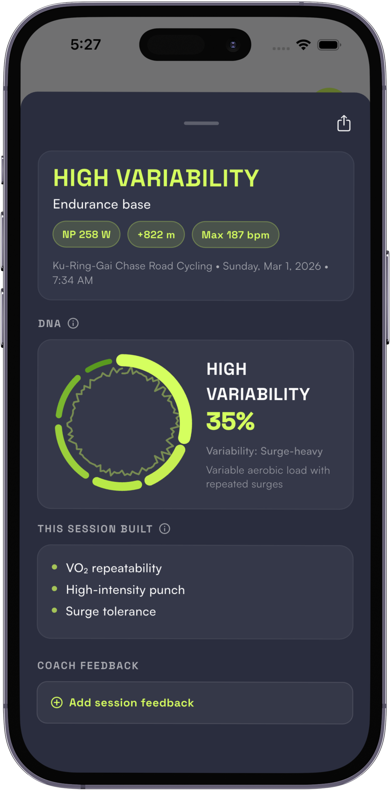
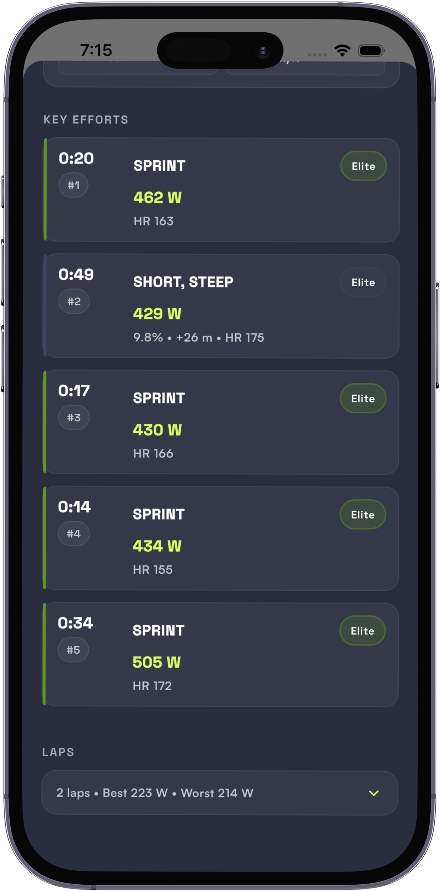

# Streeka — Press Pack

**An AI cycling coach you can actually chat with — that tells you why.**

An AI training app for cyclists and runners you chat with in plain language. It rebuilds your plan when the week goes sideways — and explains every change, so you're never guessing and never trusting a black box.

- **Website:** [streeka.com](https://streeka.com)
- **Platforms:** iOS + Android
- **Price:** Free 2-week trial, then $14/month (US) / $29/month (AU)
- **Press contact:** Sam Sutherland, Founder — sam@streeka.com
- **Demo video (90s):** https://www.youtube.com/watch?v=AVmK-vqnzGg

---

## The angle

Most training apps hand you a dashboard and leave you to interpret it. Streeka is a coach you chat with.

The category splits in two: heavyweight tools built for *coached* athletes that hand you a screen full of numbers to decode yourself (TrainingPeaks), and rigid plan generators that hand you a fixed block and quietly fall apart the moment Tuesday goes sideways (JOIN, generic PDF plans). Between them sits the largest group of cyclists — the recreational rider with a desk job, a family, and real ambition — with nothing built for how their week actually goes.

Streeka closes that gap in a way the others can't copy easily: you *chat with it*. Ask it a question in plain language and it answers from your own ride data. When the week goes sideways — missed session, work blew out, slept badly — it rebuilds the plan and **tells you why it made each change**, instead of leaving you to guess or to trust a black box.

> **For roundup editors:** This is the missing entry between "data tool for coached athletes" and "nothing." It fills the gap your fitness section leaves open — a coach the solo rider can actually have a conversation with.

---

## What it does

Streeka connects to your bike computer and watch, reads what you actually did, and rebuilds your plan around it — then explains the *why* in plain language through an in-app AI coach you can just chat with.

**The pieces that make it different:**

- **A plan that re-plans itself.** Weekly training that adapts to completed, missed, or moved sessions instead of marching on as if nothing happened.
- **SAMI, the AI coach.** Ask "what does my Saturday ride say about my fitness?" and get a real answer grounded in *your* data — not a generic chatbot.
- **Insights that mean something.** Sustainable power, efficiency (watts per heartbeat), and fitness/fatigue/form trend — each with a plain-English read and a confidence level, not just a chart.
- **Ride DNA.** Every ride is auto-classified (e.g. "High Variability — surge-heavy") with what it actually built: VO₂ repeatability, surge tolerance, high-intensity punch.
- **Key efforts, benchmarked.** Your best sprints and climbs scored against an Elite standard, automatically.
- **Streaks + weekly summary.** Proof you're showing up, built for motivation through the messy stretches.

**Connects with:** Garmin (full sync + automatic plan push to device), Wahoo (sync + plan integration), and Strava.

---

## Why it exists

Sam Sutherland built Streeka because he couldn't find a training app that handled the gap between ambitious goals and a genuinely messy schedule. Every option assumed a tidy week he didn't have. So he built the one that didn't.

That's the whole product thesis: most training advice is written for the week you planned. Streeka coaches the week you got.

---

## Traction & credibility

- **Around 40 paying subscribers** — real revenue, not free signups.
- iOS + Android, live and shipping.
- Built and run by a cyclist for cyclists — founder-led, founder-used daily.

> "I came back without guessing, panicking, or overdoing it."
> — Tim, ultra runner, returning to training after a week off sick

---

## Founder

**Sam Sutherland** — Founder, Streeka. Lifelong cyclist; built Streeka after years of fighting training apps that broke the first time real life intervened. Available for interview, comment, or a hands-on walkthrough.

---

## The app

| | | |
|:---:|:---:|:---:|
|  |  |  |
| **A plan that re-plans itself** | **Insights with a plain-English read** | **Power & efficiency, with confidence** |
|  |  |  |
| **SAMI — ask your data anything** | **Ride DNA: what each ride built** | **Key efforts, benchmarked** |

---

## Assets

All assets in this pack are cleared for editorial use.

| Asset | File / Link |
|---|---|
| Demo video (90s walkthrough) | https://www.youtube.com/watch?v=AVmK-vqnzGg |
| App screenshots (7, high-res) | `press/assets/b808ea7dedf*.png` — Training Plan, Insights, Power & Efficiency, Key Efforts, Ride Stats, Ride DNA, AI coach (SAMI) |
| Founder headshot | `press/assets/instaheadshot.jpeg` |
| Logo / wordmark | *(to add)* |

**Want to try it?** Happy to set up a free press account so you can use the app with no paywall — just reply and I'll send credentials.

---

*Streeka · streeka.com · sam@streeka.com*
